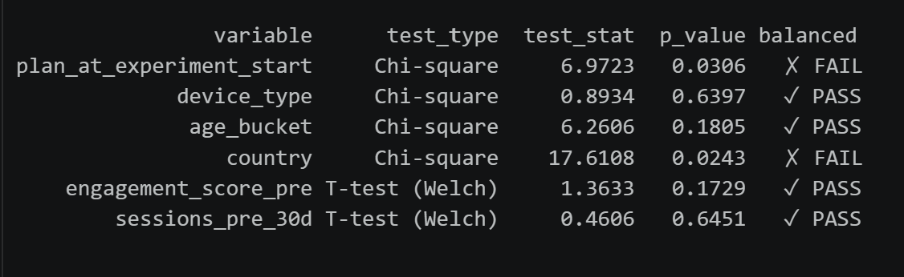
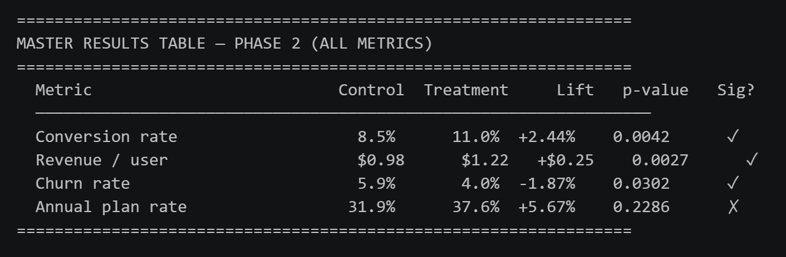
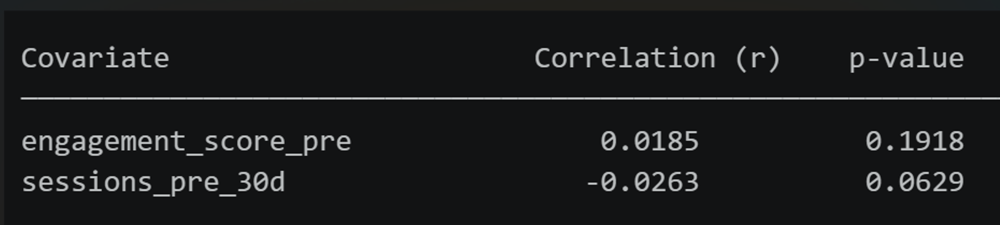
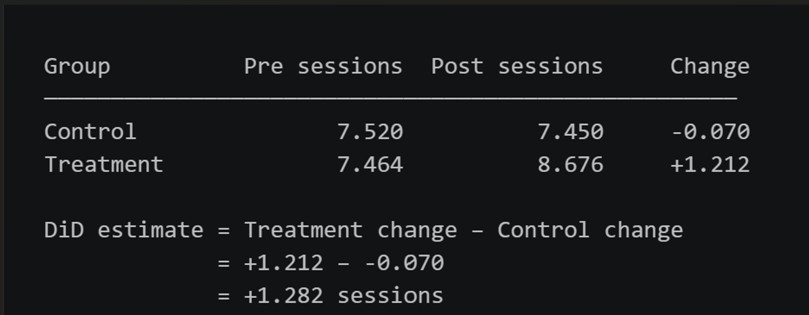
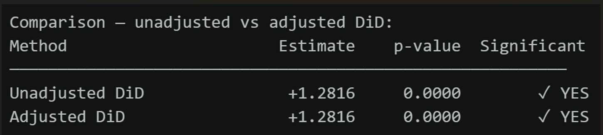
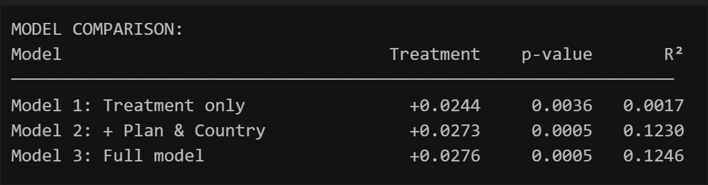
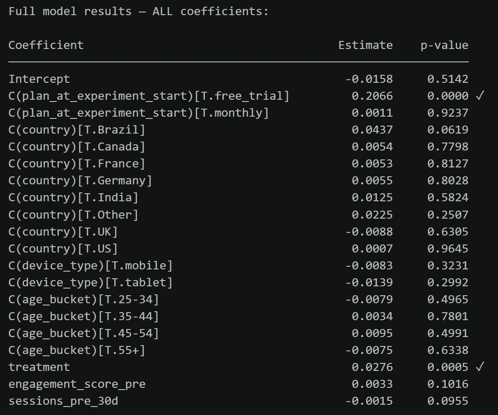
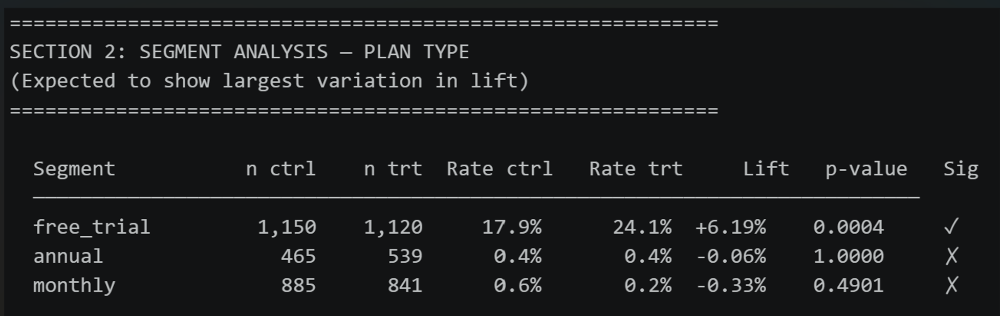
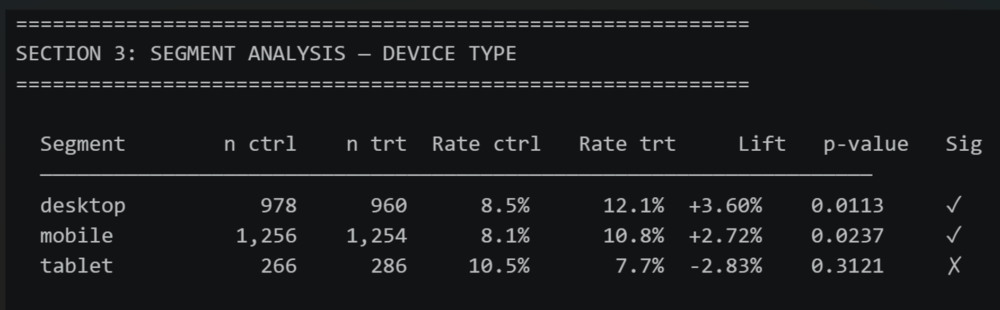

## Introduction

Subscription SaaS (Software-as-a-Service) businesses rely heavily on their pricing page to keep current users and attract new customers. It is an important touchpoint in the customer journey. A poorly set up pricing page can lead to disinterest and cause users to abandon the website, even if they are interested in the product.

In this hypothetical scenario, a SaaS company is looking to revamp its payment plan. Currently, the pricing page uses a monthly/annual toggle format that presents two plan options with minimal context.

It presents little information on the value of higher-tier payment plans for prospective customers. As a result, the conversion rates for free trial users have plateaued. If there were a more robust payment page, the pricing experience for users could improve.

## Experiment

A redesigned pricing page 3-tier plan with plan options side by side with supporting information was developed and tested.
The experiment ran for 30 days from January 15 to February 14, 2024. 

5000 users were randomly assigned and evenly split into two groups:

- Control group (2500 users): Saw the prior monthly/annual toggle pricing page. 

- Treatment group (2500 users): Saw the new 3-tier pricing page.

The primary objective is to test whether the redesigned pricing page increases the rate at which users convert from free to a paid subscription.

Outside of the main conversion metric. I tracked and identified both secondary and guardrail metrics to 
ensure that improvements in conversion did not negatively affect other outcomes:

- Revenue per User: Did the treatment generate more revenue per user exposed in the experiment?
- 30-day churn rate: Did treatment users stay, or did they cancel their plan?
- Annual plan: Did the new page shift converters towards annual plans?
  
## Methodology

**Data Acquisition**

Given the difficulty in finding real company SaaS user behavioral data, I generated a synthetic dataset using Claude (Anthropic). In collaboration, I tried to simulate real SaaS subscription data, which included user demographics, pricing page interactions, and conversion results.

**Statistical Methods**

The analysis will combine statistical testing with causal inference methods to evaluate the experiment.

**A/B Testing:** Classical hypothesis test that tests whether variation in behaviors on a website is statistically significant. Power analysis will be performed first to confirm that our sample size is large enough to detect a meaningful effect. Both primary and secondary metrics will be tested using the appropriate statistical test. Results will be reported with p-values and lift figures.

**Causal Inference:** To complement the results of the A/B test, causal inference techniques will be used to determine the confidence in the results:
- CUPED (Controlled-experiment Using Pre-Experiment Data) was used to test whether pre-experiment user behavior could reduce variation in the treatment effect estimate.
- Difference-in-Differences (DiD) was used to measure whether the treatment made meaningful user engagement changes outside of natural trends by seeing how groups changed from pre-experiment to post-experiment.
- OLS Regression looked at the treatment effect while also pairing it with multiple user-level characteristics to see the stability of the treatment coefficient across different regression models.

**Other Studies to be Performed**

**Subgroup Analysis:** I'll be examining the conversion lift broken down across four segments: plan type, device type, age group and country. Interactions test will then be used to confirm whether the difference across segments was statistically significant.

**Behavioral Funnel:** A customer behavior funnel was created to see where in the user journey the treatment had the most impact. Each stage was analyzed seperately for both control and treatment groups. Using overall funnel rates and step-over-step conversion rates, I looked at what the overall pipeline health is. 

## Data Overview

There are 5,000 rows and 18 columns that are comprised of a mix of user background, pricing page behavior, and pre/post experiment data.

---------------------------

| Variable Name | Definition |
|---|---|
| `user_id` | Unique identifier for each user |
| `experiment_group` | Pricing page version the user was shown (control or treatment) |
| `signup_date` | Date the user first signed up for the platform |
| `experiment_start_date` | Date the experiment began (January 15, 2024 for all users) |
| `country` | Country where the user is located |
| `device_type` | Primary device used to access the pricing page (mobile, desktop, tablet) |
| `age_bucket` | User's age group (18-24, 25-34, 35-44, 45-54, 55+) |
| `plan_at_experiment_start` | Subscription plan the user held when the experiment began (free trial, monthly, annual) |
| `engagement_score_pre` | Composite score (1–10) measuring how actively the user engaged with the platform before the experiment |
| `sessions_pre_30d` | Number of platform sessions in the 30 days before the experiment started |
| `pricing_page_views` | Number of times the user visited the pricing page during the experiment |
| `time_on_pricing_page_sec` | Total time in seconds the user spent on the pricing page during the experiment |
| `converted_to_paid` | Whether the user upgraded to a paid plan during the 30-day window (1 = yes, 0 = no) |
| `plan_chosen` | Plan selected at conversion (monthly, annual, or none if no conversion) |
| `days_to_conversion` | Number of days between experiment start and conversion (blank if user did not convert) |
| `revenue_30d_usd` | Revenue generated by the user in the 30 days following experiment start |
| `sessions_post_30d` | Number of platform sessions in the 30 days after the experiment started |
| `churned_within_30d` | Whether an existing paid user cancelled their subscription within 30 days (1 = yes, 0 = no) |

## Data Exploration

When exploring the dataset, I found the following:

- Data types were properly assigned.
- Searched for missing values. The only variable with nulls is days_to_conversion, which is normal since not every user converted within the 30-day period.
- With the exception of plan_at_experiment_start and country, distributions for every variable were close to an even split. There were slightly more free trial users and US users in the treatment group.

I also performed chi-square and t-tests to see if the distributions among the variables were significantly different between control and treatment groups. The distribution difference found on plan_at_experiment_start and country was found to be statistically significant. These two variables will need to be examined closely as they may influence our results outside of the treatment, which can skew our results.

<!-- -->

## Results

### A/B Test

I tested whether the new pricing page improved conversion. I'll be looking at not just conversion but also other guardrail metrics. An increase in conversion but a decrease in our guardrail metrics would have weakened the results.Overall, all the metrics resulted in desirable outcomes. 

The primary metric, conversion rate, improved in the treatment group. The churn rate went down, revenue per user and annual plan mix went up. Three of the metrics were also found to be statistically signficant (conversion rate, revenue per user, and churn rate).

<!-- -->

### Causal Inference

The A/B test showed us that the new pricing page improved conversions. Causal inference will dig deeper to make sure the treatment (pricing page) was the sole driver of increased conversions, and that there aren't any outside influences.

#### CUPED

Using CUPED, I checked to see whether pre-experiment user behavior had any influence on the conversion lift.  The CUPED analysis showed that pre-experiment user behavior was a weak predictor of conversion (r<0.03). This strengthens my confidence in the A/B test results.

<!-- -->

#### DiD

I used the Difference-in-Differences (DID) technique to confirm that the improvement in user engagement in the treatment group happened directly because of the treatment as opposed to a natural change over time.

We can see that pre-experiment sessions in the control (7.52) and treatment (7.46) started from the same baseline which means the parallel trends assumption holds. This means that in the absence of treatment both groups would've followed a similar trend.

I also discovered through the DiD estimate that treatment users had 1.28 more sessions user over the 30 day window than without the new pricing page. The p=0.0000 tells us that the engagment difference didn't happen by random chance.

Unadjusted and adjusted DiD is indentical (1.2816) which shows that the imbalances found before in the exploration had no effect on engagement.

<!-- -->

-------------------------------------------------------------

<!-- -->

#### OLS Regression

I performed linear regression to see if specific characteristics about the users, outside of the treatment, explain the conversion observed. There are three models that I created to look at what moves the needle.

Started with a baseline model with just the treatment - which says that users in the treatment group converted (2.44pp) more than the control group. When adding different covariates, I found there to be a minimal difference as the coefficient moved from 2.44pp to 2.76pp.

I also found that the plan type [free trial] was the most important user characteristic predicting conversion  (+20.66pp). Free users convert at higher rates than monthly or annual subscribers

<!-- -->

-------------------------------------------------------------

<!-- -->

#### Subgroup Analysis

To further understand who is most responsive to the treatment, I will be looking into further demographic breakdown of the users. I'll be examining conversion life across plan type, device type, age bucket and country. I will calculate conversions rates for control and treatment, compute the life for each segment, and test for statistical significance using chi-square test.

In the results we can see that only three segments reached statistical signifiance: free trial (plan type), desktop (device type) and mobile (device type). The other segments such as age groups, countries did not reach significance, likely because of the small sample size.

The free trial users are the only group to have a positive lift (+6.19%) and statistical significance (p=0.0004). This tells us that the overall lift is being driven by the free trial segment. This impact is also shown when performing the interaction tests, as the treatment x free_trial group has the best estimate and is statistically significant.

Desktop (+3.60pp) and mobile (+2.72pp) are both significant and show positive lifts. Tablet users however, show a negative trend (-2.83pp). Though not significant, it's still worth investigating.

<!-- -->

-------------------------------------------------------------

<!-- -->

#### Behavioral Funnel

### Recommendations

### Limitations
